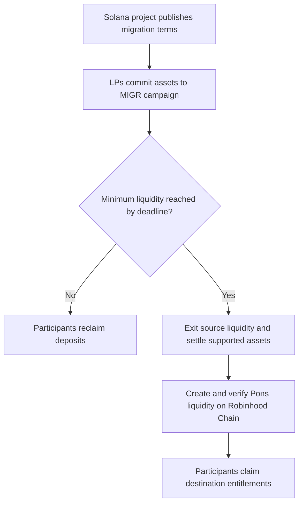
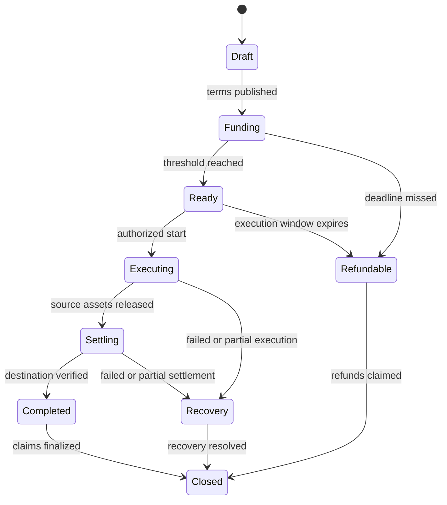

  

<h1 align="center">MIGR</h1>

<strong>Move liquidity to Robinhood Chain. Powered by Pons.</strong>

<code>Solana → MIGR → Pons → Robinhood Chain</code>

---

> **MIGR** is a proposed Solana-native coordination protocol for projects that want to move token communities and liquidity into Pons on Robinhood Chain. Projects publish verifiable migration terms; liquidity providers commit voluntarily; a migration proceeds only when its conditions are met.
>
> **$MIGR** is the proposed Solana token used for project bonds, campaign creation and, if implemented, operator security. Liquidity providers do not need to purchase $MIGR to participate.

| Token overview | Details |
|---|---|
| Project | MIGR |
| Ticker | `$MIGR` |
| Token origin | Solana |
| Destination ecosystem | Pons / Robinhood Chain |
| Category | Liquidity migration coordination |
| Primary users | Solana projects, token holders, liquidity providers, migration operators |
| Core utility | Publish migration campaigns with a project bond; coordinate commitments and settlement |
| Token standard, supply, decimals | SPL token; supply and decimals are not documented here |
| V2 Official Migr Protocol mint address | HNazMWySREpLBoyEdsXPPzvvc4eZ6avQDwqBko3vpump |
| V2 program ID | Standard SPL Token Program: `TokenkegQfeZyiNwAJbNbGKPFXCWuBvf9Ss623VQ5DA` |
| V2 environment | Solana Mainnet; the separate planned V1 test uses Devnet |
| V2 explorer links | [V2 mint](https://explorer.solana.com/address/HNazMWySREpLBoyEdsXPPzvvc4eZ6avQDwqBko3vpump); [SPL Token Program](https://explorer.solana.com/address/TokenkegQfeZyiNwAJbNbGKPFXCWuBvf9Ss623VQ5DA) |
| Image | [`migr.png`](./migr.png) |
| Status | Concept and proposed V1 scope; no deployed contract is asserted here |

> **Contract verification:** The listed SPL Token Program is Solana infrastructure, not a deployed MIGR application. Its identifier does not implement campaigns, vaults or migration. The V2 mint address identifies the token only; a dedicated application program would require its own deployment and separate program ID. The planned V1 test mint and campaign program have not been deployed. [Solana program reference](https://solana.com/docs/references/terminology).

---

# How MIGR Works

The campaign records commitments on Solana. Destination liquidity is created only after a supported settlement route and a Pons-compatible execution path have been deployed and verified. Until then, the V1 test covers the commitment and refund stage only.

---

# Summary

A Solana project may want to establish a market on Robinhood Chain through Pons, but cannot know in advance whether its holders and liquidity providers will follow. MIGR lets the project announce a destination, a minimum commitment, a deadline, an execution plan and funded incentives. Participants see the same terms before committing assets. If the threshold is reached, a separately authorized execution path can unwind source positions, move eligible value and establish destination liquidity. If it is not reached, the campaign closes and participants reclaim their deposits.

**MIGR coordinates migration; it does not itself guarantee a bridge, an exchange rate, a destination listing or Pons integration.** Those require actual deployed contracts, supported routes and published execution rules.

---

# The Problem

A token can have a Solana community, active holders and deep liquidity while having no usable market on Robinhood Chain. A unilateral launch on a second chain can split supply, strand LPs and create confusing claims to the same asset. Moving LP positions is also more complex than transferring a fungible token: pool assets must be withdrawn, valued, moved or swapped, and deposited into a new pool under explicit price and slippage limits.

MIGR answers the coordination question before funds move irreversibly:

> **How much liquidity will actually follow this project, under which terms, and who bears execution risk?**

---

# Relationship to Pons

| Layer | Role |
|---|---|
| Solana | Source community, campaign creation, commitments and `$MIGR` mint |
| MIGR | Thresholds, vault accounting, refunds, proofs and execution coordination |
| Cross-chain route | Transfers or settles supported assets according to a published adapter |
| Pons / Robinhood Chain | Destination token launch or approved migration path and destination liquidity |

Pons remains the Robinhood Chain destination. MIGR is situated on Solana because it coordinates the holders and liquidity at the source. An actual Pons integration must be verified against Pons's deployed contracts and rules before a campaign advertises automatic launch or LP creation.

---

# Who Uses MIGR?

- **Project team:** proposes the destination market, supplies its bond and funds incentives.
- **Liquidity provider:** commits supported source assets or opts into a documented LP withdrawal flow.
- **Token holder:** optionally exchanges or claims under a separate, published token migration plan.
- **Operator:** performs execution steps and provides evidence, subject to the security model in use.
- **Observer:** checks terms, commitments, transaction references, accounting and destination outcomes.

Participation is opt-in. A holder migration and an LP migration are separate modules; neither is silently implied by the other.

---

# Campaign Terms

Each campaign should publish an immutable or explicitly versioned configuration before deposits open:

| Parameter | Meaning |
|---|---|
| Campaign ID | Unique identifier bound to source and destination parameters |
| Source mint and pool | Solana asset and eligible liquidity venue/position type |
| Destination token and pool | Verified addresses or a clearly specified prelaunch deployment method |
| Target and minimum | Desired and required amount, measured in a defined asset or valuation rule |
| Deposit window | Opening time, deadline and any withdrawal lock |
| Accepted deposits | Token pair, supported vault assets and deposit limits |
| Conversion route | Bridge, swap and settlement providers; fees and fallback |
| Execution bounds | Minimum output, maximum slippage, price source and expiry |
| Liquidity policy | Pair, deposit ratio, range if concentrated, LP ownership and lock terms |
| Incentive escrow | Assets deposited by the team, eligibility and vesting/claim conditions |
| Failure policy | Refund rules for missed threshold, expired execution and partial settlement |
| Authority | Upgrade keys, pausing rights, operator permissions and recovery process |

A display in USD must state its price source and snapshot method. A threshold cannot safely depend on a manipulable instantaneous pool price.

---

# Migration Lifecycle

A production design needs explicit handling for partial execution: returning the original LP position may be impossible after unwinding or swapping it. The campaign must specify whether users receive the original assets, residual assets or destination claims at each stage.

---

# End-to-End Flow

## 1. Create

The team registers a Solana source asset, identifies its project authority, selects an eligible Pons destination and commits an `$MIGR` project bond. It deposits any promised LP incentives in the stated payment asset. A campaign becomes visible only after the terms and funding are verifiable.

## 2. Commit

LPs opt in and deposit supported assets or authorize a dedicated adapter to unwind a position. The vault issues an accounting receipt tied to each depositor. A displayed commitment is counted only after finality and must not count an unverified signature, a soft pledge or a withdrawn deposit.

## 3. Reach the threshold

At the deadline, the protocol compares eligible commitments against the published threshold. If the threshold fails, users withdraw the assets still held in the vault under the stated refund rules. If it succeeds, the campaign enters a bounded execution window; no one may silently alter the destination or conversion rate.

## 4. Exit, settle and re-LP

An authorized executor withdraws eligible Solana LP assets, performs any disclosed conversions, sends supported value across an approved route, verifies arrival on Robinhood Chain, and creates destination liquidity through an available Pons-compatible route. This is **exit → transfer/settlement → re-LP**, not an assumption that a Solana LP token can be bridged intact.

## 5. Verify and claim

The system records source transactions, transfer references, destination transactions, amounts and final LP ownership. Participants can claim the specific destination entitlement defined in the campaign: destination tokens, LP share, a custody receipt or a combination. Incentives are released only after qualifying completion; unspent incentives follow the published refund policy.

---

# Optional Holder Migration

Migrating the community requires its own exchange rules. A proposed holder module can accept an existing Solana token for burn or lock and allocate a newly issued Robinhood Chain token according to a published ratio and snapshot. Supply accounting must specify team reserves, circulating supply, unclaimed balances, excluded wallets and the treatment of tokens that cannot be burned. Locked tokens must not be represented as destroyed. Claims must be replay-protected, capped by the destination allocation and reconciled with source deposits.

The destination asset is a **new asset** unless an authorized issuer and a verifiable cross-chain canonical representation establish otherwise. Shared name or ticker alone does not make two contracts equivalent.

---

# $MIGR Utility

1. **Project bond.** A team escrows `$MIGR` when opening a campaign. Its release or slash rules must be published before deposits. An abandoned campaign can forfeit its bond only under objective, enforceable conditions.
2. **Campaign creation.** A fixed creation charge may be paid or burned in `$MIGR`; the amount and recipient must be public. This is the simplest V1 token utility.
3. **Operator bond, later phase.** Operators may stake `$MIGR` against invalid or missing attestations once there is an enforceable challenge and slashing system. Merely calling a stake a “security bond” is insufficient.
4. **Fee alignment, later phase.** If migrations generate actual fees, a published policy may direct part of those fees to protocol operations or on-market `$MIGR` purchases. Buybacks, burns and revenue sharing are proposals, not promises.

LPs should primarily be rewarded from the project's escrowed assets. Mandatory token purchases by LPs would add friction to the very migration MIGR aims to enable. `$MIGR` does not confer a claim on migrated user deposits.

---

# Fee and Incentive Design

A campaign can quote a transparent migration fee on the value successfully settled, plus disclosed third-party bridge, swap and destination pool costs. No fee should be collected on a campaign that simply expires before execution, apart from any explicitly disclosed transaction costs. An illustrative project-funded incentive of 4% of migrated value is **only an example**: it must be deposited before launch, have a maximum liability and specify payout timing. The protocol must not present emissions as project-funded rewards.

Example, for illustration only:

| Item | Example |
|---|---:|
| Minimum eligible commitments | $250,000 |
| Target commitments | $500,000 |
| Team incentive escrow | $20,000 in a specified asset |
| Project bond | Amount set by governance/configuration |
| Migration fee | Published before deposits; charged only on settled value |

These are design examples, not current protocol parameters or investment projections.

---

# System Components

| Component | Proposed responsibility |
|---|---|
| Campaign registry | Immutable terms, unique IDs, allowed asset pairs and campaign state |
| Solana vault | Custody, deposit receipts, withdrawal limits and refund accounting |
| `$MIGR` mint | Creation and bond asset; mint/freeze authorities disclosed |
| LP adapter | Venue-specific withdrawal of source LP positions |
| Settlement adapter | Approved cross-chain route and transaction evidence |
| Destination executor | Creates or funds the target pool when permitted by Pons |
| Claim module | Allocates final destination entitlements to participants |
| Indexer and UI | Displays source deposits, status, fees and verified destination evidence |
| Emergency controls | Narrow pause and recovery powers with a public authority policy |

A dashboard is only an interface. Asset custody and authorization must be implemented and independently checked in the underlying programs and destination contracts.

---

# Verification and Safety Requirements

- **No double credit:** each source deposit, withdrawal and settlement reference can be consumed once.
- **Segregated accounting:** each campaign tracks its own assets and liabilities; project bonds and user deposits are separate.
- **Destination binding:** campaign IDs bind chain, mint, destination contract, recipient, minimum output and nonce.
- **Finality and reorg handling:** do not credit a source event before the route's published confirmation requirements.
- **Bounded execution:** enforce deadlines, maximum slippage and minimum assets received on each conversion.
- **Recovery:** describe bridge downtime, unsupported assets, failed pool creation, partially spent vault funds and lost operators.
- **Control transparency:** disclose admin keys, upgrade authority, guardians, timelocks and whether funds can be moved by an operator.
- **Independent review:** audit custody and settlement code before allowing meaningful third-party deposits.

A slashable operator model additionally needs objective evidence, a challenge period, adjudication and a realizable bond. Until those mechanisms exist, describe operators as trusted or permissioned where applicable.

---

# V1 Test: Narrow, Verifiable Scope

**Goal:** validate project demand and the threshold/refund mechanism on Solana before attempting cross-chain custody. A reasonable first test supports one asset pair and one campaign at a time:

- A project creates a campaign, escrows its `$MIGR` creation bond and defines a deadline and minimum in a single accepted asset.
- Participants deposit that asset to a Solana vault and receive nontransferable accounting entries.
- The UI displays verified deposits and the exact threshold calculation.
- If the deadline passes below threshold, users reclaim deposits directly.
- If the threshold is met, the V1 records success and permits withdrawal/claim according to a predeclared test policy. It **does not claim to bridge or create Pons liquidity** until those modules have been deployed and verified.
- The test publishes transactions, program ID, token mint, authorities and a small postmortem.

| V1 deployment field | Fill after deployment |
|---|---|
| Network | Solana Devnet (planned) |
| `$MIGR` mint | `[ADD VERIFIED SOLANA MINT ADDRESS HERE]` |
| Campaign program ID | No MIGR program deployed; SPL Token Program: `TokenkegQfeZyiNwAJbNbGKPFXCWuBvf9Ss623VQ5DA` |
| Vault address | No vault deployed |
| Token supply and decimals | Not set; mint not deployed |
| Mint/freeze/upgrade authorities | Not applicable until deployment |
| Explorer references | [SPL Token Program on Devnet](https://explorer.solana.com/address/TokenkegQfeZyiNwAJbNbGKPFXCWuBvf9Ss623VQ5DA?cluster=devnet); no MIGR mint or campaign link yet |
| Source code and revision | No V1 implementation published |
| Test campaign ID | No test campaign deployed |

> **V1 TEST APPLICATION PROGRAM:** Not deployed; standard SPL Token Program: `TokenkegQfeZyiNwAJbNbGKPFXCWuBvf9Ss623VQ5DA`  
> **$MIGR V1 TOKEN MINT:** `[ADD VERIFIED SOLANA MINT ADDRESS HERE]`

---

# Later Phases

**Phase 2 — assisted migration:** add a supported Solana LP adapter, publish execution quotes and run a limited pilot with explicit operator trust and destination pool verification.

**Phase 3 — programmable settlement:** integrate a supported cross-chain route, automate destination funding and enforce on-chain claims with objective reconciliation.

**Phase 4 — holder migration and open operators:** add optional holder exchange, dispute mechanisms and genuine bonded operator security only after the required proofs and recovery paths exist.

Each phase depends on functional integration, security review and destination support. A roadmap item is not a deployed feature.

---

# What MIGR Should Make Visible

A completed campaign should be understandable from public evidence: source mint and pool; participating wallets and deposits; target and achieved threshold; fees and conversion prices; Solana exit transactions; settlement references; Robinhood Chain destination transaction; resulting pool and LP owner; final claims and unresolved balances. Display both **committed** and **actually settled** liquidity, because they can differ.

The clearest product promise is:

> **Commit together on Solana. Move under published terms. Verify the liquidity on Robinhood Chain.**

---

# Important Distinctions

MIGR is a proposed migration coordination layer, not a generic bridge, a guaranteed one-to-one token conversion or an assurance of future liquidity. Actual availability depends on supported assets, a reliable settlement route, deployable destination contracts, Pons compatibility and audited custody rules. Price movements, slippage, fees, smart-contract failures and cross-chain execution can reduce the value received. Projects must disclose these terms to participants before collecting funds.

---

<strong>MIGR — Solana liquidity, coordinated for Pons.</strong>

