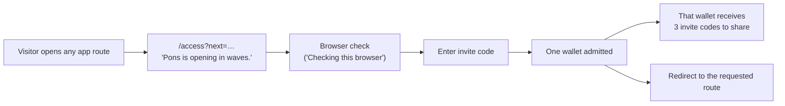
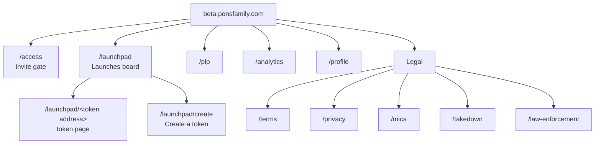
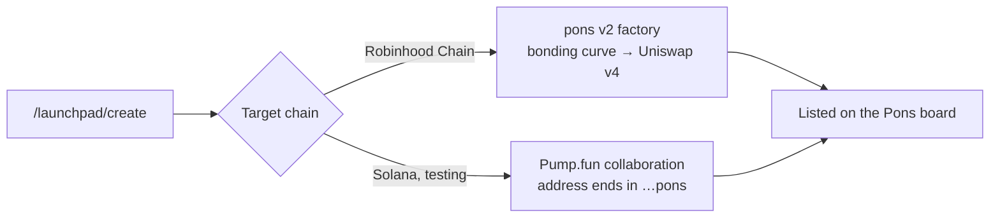
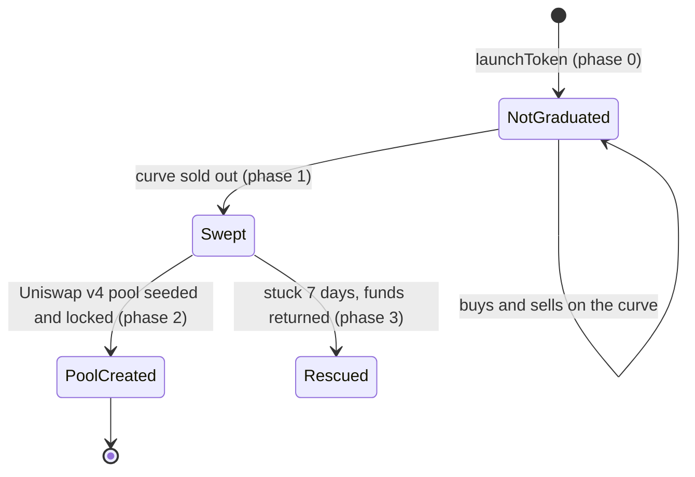

# Pons Beta

The token launchpad on Robinhood Chain.
 

Pons Beta is the invite-only beta of Pons, a noncustodial token launchpad on Robinhood Chain. A creator launches a token in two steps, the token trades on a bonding curve, and once the curve sells out it graduates into a permanently locked Uniswap v4 pool. The beta runs on the pons v2 launch contracts.

**Web:** [beta.ponsfamily.com](https://beta.ponsfamily.com) &nbsp;·&nbsp; **Chain:** Robinhood Chain (chain ID 4663) &nbsp;·&nbsp; **Access:** invite only &nbsp;·&nbsp; **Operator:** Pons Labs, LLC
 
---  
   
## Contents 

- [At a glance](#at-a-glance)
- [Access: opening in waves](#access-opening-in-waves)
- [Site map](#site-map)
- [Page anatomy](#page-anatomy)
  - [Header](#header)
  - [Footer](#footer)
- [App sections](#app-sections)
  - [Launches](#launches)
  - [Token page](#token-page)
  - [Create a token](#create-a-token)
    - [Solana launches (in testing)](#solana)
  - [PLP](#plp)
  - [Analytics](#analytics)
  - [Profile](#profile)
- [Launch mechanics (pons v2)](#launch-mechanics-pons-v2)
- [Fees and payouts](#fees-and-payouts)
- [Creator controls and takeovers](#creator-controls-and-takeovers)
- [Contracts](#contracts)
- [Legal pages](#legal-pages)
- [Security and audits](#security-and-audits)
- [Metadata](#metadata)

---

## At a glance

| | |
|---|---|
| **Product** | Pons, token launchpad |
| **Beta URL** | beta.ponsfamily.com (same app also served at pons-webapp.vercel.app) |
| **Chain** | Robinhood Chain, chain ID 4663 (Arbitrum Orbit) · Solana in testing (with Pump.fun) |
| **Protocol** | pons v2: bonding curve → Uniswap v4 with permanently locked liquidity |
| **Access** | Invite code required to enter the app |
| **Launching** | Restricted to whitelisted wallets while public launches are closed |
| **Custody** | Noncustodial. Your wallet signs every launch and every trade |
| **Built by** | Pons Labs, LLC |
| **Contact** | contact@ponsfamily.com |
| **Social** | [X @ponsdotfamily](https://x.com/ponsdotfamily) · [GitHub pons-labs](https://github.com/ponsdotfamily/ponsdotfamily) |

---

## Access: opening in waves

Every app route (`/launchpad`, `/launchpad/create`, `/plp`, `/analytics`, `/profile`) redirects to the access gate at `/access?next=<route>` until the browser holds a valid invite.

The gate page shows:

- **Headline:** *Pons is opening in waves.*
- **Body:** entry is by invite for now. One code admits one wallet, and every wallet inside holds three codes to share.
- **Status line:** *Checking this browser* (a browser check runs before the code field is usable).
- The normal header (with **Connect wallet**) and the full footer.

The legal pages (`/terms`, `/privacy`, `/mica`, `/takedown`, `/law-enforcement`) are public and not gated.

---

## Site map

| Route | Page | Gated |
|---|---|:---:|
| `/` | Redirects to `/launchpad` | ✓ |
| `/access` | Invite gate | — |
| `/launchpad` | Launches (the board) | ✓ |
| `/launchpad/create` | Create a token | ✓ |
| `/launchpad/<address>` | Token page (e.g. PONS) | ✓ |
| `/plp` | PLP | ✓ |
| `/analytics` | Analytics | ✓ |
| `/profile` | Profile | ✓ |
| `/terms` | Terms of Use | — |
| `/privacy` | Privacy Policy | — |
| `/mica` | MiCA Whitepaper | — |
| `/takedown` | Takedown Requests | — |
| `/law-enforcement` | Law Enforcement Requests | — |

---

## Page anatomy

Every page shares the same header and footer.

### Header

| Element | Target / behaviour |
|---|---|
| Pons logo + wordmark | `/launchpad` |
| `/` | Keyboard shortcut hint (search / command) |
| **Launches** | `/launchpad` |
| **Create a token** | `/launchpad/create` |
| **PLP** | `/plp` |
| **Analytics** | `/analytics` |
| **Theme** | Light / dark toggle (light theme color `#f5f5f7`) |
| **Connect wallet** | Wallet connection (Reown) |

### Footer

Three link columns, then copyright, social icons and a disclaimer.

| Launchpad | Resources | Legal |
|---|---|---|
| [Launches](https://beta.ponsfamily.com/launchpad) | [Docs](https://docs.ponsfamily.com) | [Terms of Use](https://beta.ponsfamily.com/terms) |
| [Create a token](https://beta.ponsfamily.com/launchpad/create) | [Explorer](https://robin.etherscan.io) | [Privacy Policy](https://beta.ponsfamily.com/privacy) |
| [PLP](https://beta.ponsfamily.com/plp) | [PONS token](https://beta.ponsfamily.com/launchpad/0x39dBED3a2bd333467115dE45665cC57F813C4571) | [MiCA Whitepaper](https://beta.ponsfamily.com/mica) |
| [Analytics](https://beta.ponsfamily.com/analytics) | [Updates on X](https://x.com/ponsdotfamily) | [Takedown Requests](https://beta.ponsfamily.com/takedown) |
| [Profile](https://beta.ponsfamily.com/profile) | [GitHub](https://github.com/pons-labs) | [Law Enforcement Requests](https://beta.ponsfamily.com/law-enforcement) |

Below the columns:

- © 2026 Pons Labs, LLC. All rights reserved.
- Icons for X and GitHub.
- **Disclaimer:** Pons is a noncustodial software interface operated by Pons Labs, LLC. It does not hold assets or keys, does not execute or reverse transactions, and is not a bank, broker, exchange, custodian or investment adviser. Nothing on the site is financial, legal or tax advice. Tokens are issued by their creators, not by Pons, and can be highly volatile, lose all value or have no liquidity. Listing or ranking a token is not an endorsement. Not available in restricted regions. Pons is not affiliated with Robinhood Markets, Inc.

---

## App sections

> The app routes sit behind the invite gate, so their in-app layout isn't publicly visible. What follows is what the site's navigation, legal pages and the v2 docs confirm about each section.

### Launches

**Route:** `/launchpad` · **Nav:** header and footer

The board of launches, and the page the Pons logo links to. Tokens are featured or ranked by neutral criteria such as volume, activity or recency, and ranking is not an endorsement. Each launch can be followed as it raises, graduates and lists.

### Token page

**Route:** `/launchpad/<token address>` · **Example:** [PONS](https://beta.ponsfamily.com/launchpad/0x39dBED3a2bd333467115dE45665cC57F813C4571)

One page per token, keyed by contract address: details, price, graduation progress, trading, and wallet-signed token chat. Trades route to the bonding curve before graduation and to the Uniswap v4 pool after it.

### Create a token

**Route:** `/launchpad/create` · **Nav:** header and footer

Launch form in two steps: fill in the token, then sign. Eligibility is checked onchain with `canLaunch(address)`, since launching is limited to whitelisted wallets. Solana launches are in testing ([see below](#solana)).

Fields in the `/launchpad/create` form:

| Field | Notes |
|---|---|
| Name, symbol | Fixed at launch, stored on the token contract |
| Logo, description | Fixed at launch |
| Twitter, Telegram, Discord, website, Farcaster | Stored on the token contract (`socials()`) |
| Pair asset | ETH or a pons-approved ERC-20 (stablecoin, tokenised stock). Fixed at launch |
| Creator tax | Optional, capped by `maxCreatorTaxBps()`, can't be raised later |
| Buyback | Optional, on/off after launch |
| Creator fee recipient | Defaults to the launching wallet, changeable after launch |
| Snipe-tax exemptions | Optional, up to 32 extra wallets for team bundles |
| Initial buy | Optional, via the launch-and-buy router in the same transaction |

#### Solana launches (in testing)

A hybrid integration is in testing that lets `/launchpad/create` launch tokens on **Solana** as well as Robinhood Chain, so Pons becomes a full 360° launchpad: one create flow, one board, two chains.

Test V2: 4Ts6pM5aKcd5Po3mqaLCtzZgqZrz9c1LTj8AGzDqpons

Future Url: https://beta.ponsfamily.com/launchpad/4Ts6pM5aKcd5Po3mqaLCtzZgqZrz9c1LTj8AGzDqpons

Test V3: 8tzJwXW1oiJ5FvabWW3Wkd1VArSsypXkfNepRWBrpons

Future Url: https://beta.ponsfamily.com/launchpad/8tzJwXW1oiJ5FvabWW3Wkd1VArSsypXkfNepRWBrpons

| | Robinhood Chain | Solana (testing) |
|---|---|---|
| Launch venue | pons v2 launch contracts | In collaboration with **Pump.fun** |
| Token addresses | CREATE2, deterministic | Vanity addresses ending in **`pons`** |
| Status | Live, whitelisted launchers | 🧪 In testing | 

The address suffix makes every Solana launch from Pons recognisable at a glance. Launch rules, fees and graduation terms for the Solana side will be documented once the integration leaves testing.

### PLP

**Route:** `/plp` · **Nav:** header and footer

Gated section. The Terms of Use cover liquidity positions and range/limit orders, which can expose users to impermanent loss and out-of-range positions and may need a separate claim or withdrawal transaction after execution.

### Analytics

**Route:** `/analytics` · **Nav:** header and footer

Protocol and market analytics for launches on Pons.

### Profile

**Route:** `/profile` · **Nav:** footer only

Public profile tied to a wallet: username, bio, avatar, links and notification settings.

---

## Launch mechanics (pons v2)

These rules are enforced by the contracts, not by the interface.

| Rule | How it works |
|---|---|
| **Fixed supply, no pre-mint** | The full supply is minted to the curve. Nobody, creator included, holds tokens before trading opens |
| **Bonding curve** | Constant product with a phantom quote reserve, so the price opens above zero. Buys push it up, sells push it down; you can always sell back until the curve sells out |
| **Snipe protection** | Buys pay a tax starting at 99% and decaying exponentially to zero over 5 seconds (~25% at 1s, ~3% at 2s). Sells are never taxed. Proceeds join the trading fee, nothing is burned. Launcher and fee recipient are exempt |
| **Graduation** | When the curve sells out it closes. Everything collected plus a reserved share of supply seeds a full-range Uniswap v4 pool, automatically inside the final buy. Anyone can push a stalled graduation with `createGraduatedPool` |
| **Deterministic pool** | Reserved share = `supply × phantomQuote ÷ (phantomQuote + threshold)`, so every launch on the same config graduates into the same pool at the same price |
| **Partial last fill** | A buy larger than what's left is filled to the edge and the rest refunded in the same transaction |
| **Locked liquidity** | The pool position is locked permanently. No withdrawal function exists for anyone, pons included |
| **Custom pairs** | A launch can be priced in any approved asset instead of ETH; that asset is used for buys, sells, graduation threshold, pool and payouts |
| **Immutable terms** | Supply, pricing, pair asset, tax and graduation terms can't change after launch |

---

## Fees and payouts

| | |
|---|---|
| **Trading fee** | Same rate on the curve and in the pool. The v4 pool itself charges 0%; the pons hook charges the fee |
| **Fee split** | Protocol share first, then an optional buyback slice, the rest to the creator. Snapshotted at launch |
| **Creator tax** | Optional, capped, 100% to the creator |
| **Payout asset** | Always the launch's pair asset (ETH, stablecoin or stock token). Post-graduation token-side fees are converted before payout |
| **Claiming** | Fees accrue in an escrow and are withdrawn by the creator, one balance per asset |
| **Buybacks** | Optional, funded from the creator's share. Bought tokens are not burned; they vest linearly over 5 years, split between creator and protocol |

---

## Creator controls and takeovers

After launch a creator can change only two things: **where fees go** and **whether buybacks run** (pons can turn buybacks off, never on). There is no mint, no freeze, no blacklist and no post-launch tax.

**Community takeovers (CTO):** a creator can hand fees to a community wallet directly, or pons can propose a new recipient for abandoned tokens through a public 3-day timelock (then a 3-day execution window). Requests go through the [pons CTO form](https://forms.gle/JjrWvybFeNfE5v8F6).

**Migration:** dead tokens launched elsewhere can move their community onto a fresh pons pool through epoch-based deposits, paced sales of the old coin, and a 90-day claim window.

---

## Contracts

<b>pons v2, Robinhood Chain (4663)</b>

| Contract | Address |
|---|---|
| Launch factory | `0x7eD598BcEf8bd9Edd8C97A195C6d13f40801EC7e` |
| Meme hook (Uniswap v4) | `0xE5e702641Ea86F4ae6cC3cDaeD2B886f976Be044` |
| Fee escrow | `0xd3AFEB2a57f70eF218Aa82451c51B2fb0416Ac9e` |
| Buyback vault | `0x42df2a798f82289E177311362e8f5ccC45c1219c` |
| Launch locker | `0x267444D099b10fB5Ed7c3Cc7B7c767AdcA574952` |
| Launch and buy router | `0xe33E9E479dF8802cb0866d5d05258bEc4cF62948` |
| Launch deployer | `0x3711ceA4feaDE896C913C68F01Eda97Cb06D1A42` |
| Graduation executor | `0xC7819B64A1dAECD7eC19856d026cb14EfBd89046` |
| Graduation guard | `0xf5695117b99B6f6401e67d4195BD653628176C6C` |

Each launch also gets its own curve and token, deployed via CREATE2.

<b>PONS token</b>

| | |
|---|---|
| Token | `0x39dBED3a2bd333467115dE45665cC57F813C4571` |
| Pool | `0x10CC6BD38112cAc182db90B6a71d8Bb5939526bA` |
| Status | Graduated, launched through the v1 legacy factory |

Full reference: [docs.ponsfamily.com/v2](https://docs.ponsfamily.com/docs/v2). The v1 protocol (direct Uniswap V3 launches against WETH) is documented at [docs.ponsfamily.com](https://docs.ponsfamily.com/docs) and keeps operating.

---

## Legal pages

| Page | Contents |
|---|---|
| **Terms of Use** (effective 16 Jul 2026) | 26 sections. 18+, Delaware law, AAA arbitration in Wilmington with 30-day opt-out. Restricted jurisdictions include Cuba, Iran, North Korea, Syria, Russia, Belarus, occupied Ukrainian regions, Myanmar, Venezuela, **the United Kingdom and every EU member state** |
| **Privacy Policy** (effective 15 Jul 2026) | 17 sections. No sale of personal data, no targeted ads. Providers named: Cloudflare, Vercel, Reown, Robinhood Chain RPC, Envio, Blockscout, IPFS gateways, market data providers |
| **MiCA Whitepaper** | The pons crypto-asset whitepaper under the EU MiCA regulation |
| **Takedown Requests** | Form for copyright, trademark, likeness or personal-data claims. Pons removes the token from its own site (page, search, board, link previews); the token keeps existing onchain |
| **Law Enforcement Requests** | Form routed to Pons counsel. Pons may hold profiles, linked wallet, notification settings, launch metadata and short-lived security logs; no legal names, IDs or keys. 90-day preservation, emergency flag for risk to life |

---

## Security and audits

| Area | Status |
|---|---|
| Custody | Noncustodial. Pons builds transactions, your wallet signs them |
| Liquidity | Graduated positions locked permanently, no unlock path |
| v2 contracts | Three audits in progress: SB Security, Dingbats, Pashov Audit Group. None has closed. **Treat v2 as unaudited until reports are published** |
| Launching | Public launches closed, whitelisted wallets only |
| Disclosure | Report issues privately to contact@ponsfamily.com |

> **Risk.** Onchain transactions are irreversible. Names and symbols can be copied, so always check the token address. Graduation is not a quality signal. Nothing here is financial advice.

---

## Metadata

| Tag | Value |
|---|---|
| `<title>` (gate) | Invite only · Pons |
| Description | Pons is opening in waves. Enter with an invite code. |
| OG / Twitter title | Pons · Token launchpad on Robinhood Chain |
| OG description | Launch a token in two steps, trade it on a bonding curve, and follow every launch as it raises, graduates, and lists |
| Robots (app) | `noindex, nofollow` |
| Robots (legal) | `index, follow` |
| Twitter | `@ponsdotfamily` |
| Category | finance |

---

**Pons Beta** · token launchpad on Robinhood Chain

© 2026 Pons Labs, LLC · not affiliated with Robinhood Markets, Inc.

