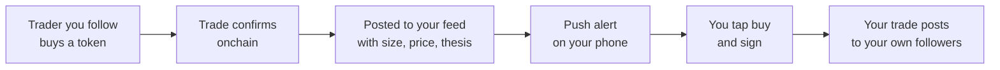
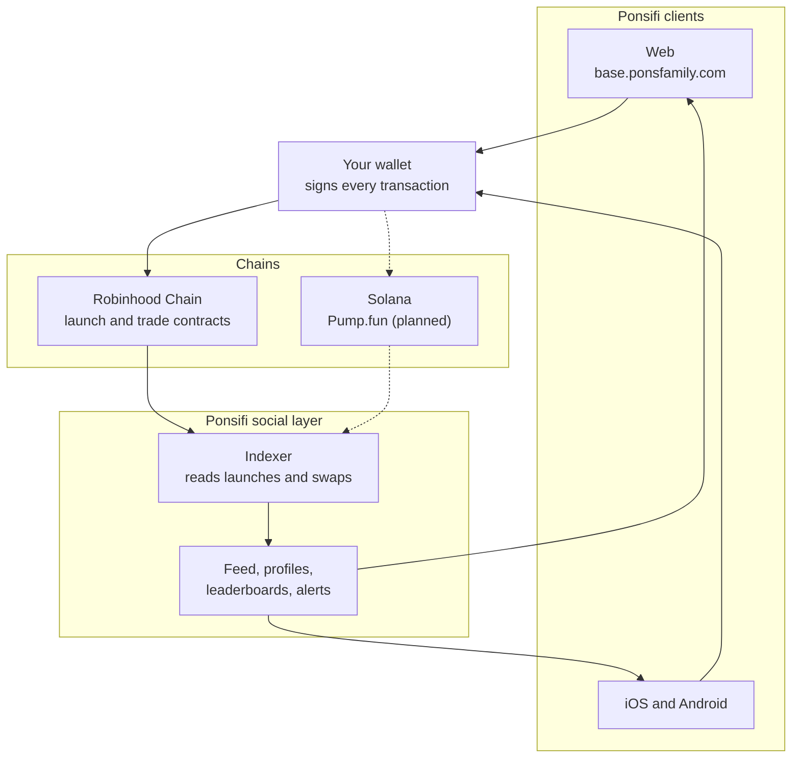
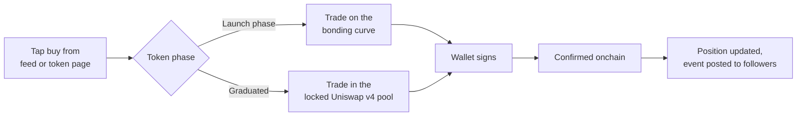
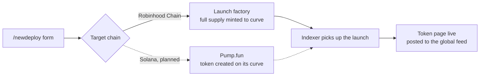
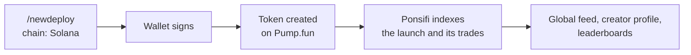
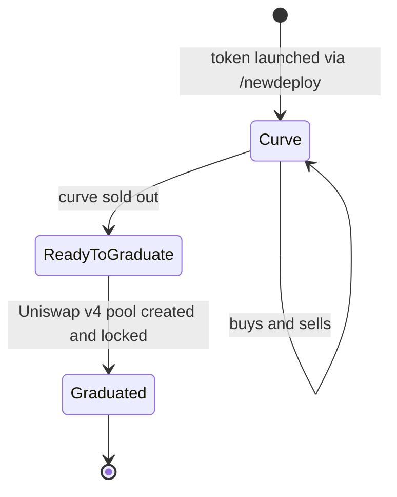

<div align="center">


# Ponsifi

Social trading on Robinhood Chain

</div>

Ponsifi is a social trading app where trading is a feed. You follow traders instead of charts, their buys and sells show up in your timeline as they confirm onchain, and every profile carries a record built from the chain. Launches happen in the same place through `/newdeploy`, so new tokens reach the network the moment they go live.

**Web:** [base.ponsfamily.com](https://base.ponsfamily.com) &nbsp;·&nbsp; **Chains:** Robinhood Chain, Solana (planned) &nbsp;·&nbsp; **Status:** in development

---

## Contents

- [What Ponsifi is](#what-ponsifi-is)
- [Status](#status)
- [How it works](#how-it-works)
- [The feed](#the-feed)
- [Profiles and leaderboards](#profiles-and-leaderboards)
- [Trading](#trading)
- [`/newdeploy`](#newdeploy)
  - [Robinhood Chain](#robinhood-chain)
  - [Solana](#solana)
- [Launch mechanics on Robinhood Chain](#launch-mechanics-on-robinhood-chain)
- [Mobile](#mobile)
- [Data and integration](#data-and-integration)
- [Security](#security)
- [Roadmap](#roadmap)

---

## What Ponsifi is

**Ponsifi is a social trading app. On Ponsifi, trading is a feed.**

You don't follow charts here. You follow people.

Onchain markets move on who is buying, not on what an indicator says. The traders who get in early leave a trail on the chain, but today that trail is scattered across block explorers, group chats and screenshots nobody can verify. By the time you've pieced it together, the move is over. Ponsifi turns that trail into a live social network: every trade is a post, every trader has a public track record, and acting on what you see takes one tap.

### Follow people, not charts

You follow traders the way you follow accounts on any social app. From that moment:

- **Their trades become your feed.** Every buy and sell they make shows up in your timeline the second it confirms onchain, with the token, the size and the price.
- **You get pinged when they move.** Turn on alerts for a trader and your phone buzzes when they enter or exit a position.
- **You can act instantly.** Every trade in the feed has a buy button on it. Tap it, sign, and you hold the same token.

### Every trade is public, every record is real

This is what makes the network worth following.

- **Realized PnL on every trade.** When someone sells, the feed shows what they actually made or lost. Wins and losses both go on the record.
- **Profiles are built from the chain.** Holdings, history, win rate and PnL are computed from onchain data. Nobody can fake a call they didn't make or delete one that went wrong.
- **Leaderboards rank real results.** The top of the board is the traders who are actually making money, ranked by realized PnL over rolling windows.

### Context, not just signals

A buy on its own tells you *what*. Ponsifi also shows *why* and *where*.

- **Theses.** A trader can attach a short note to a trade explaining the reasoning, so you're following a thought process and not just a wallet.
- **Trades on the chart.** On any token page, the buys and sells of people you follow are drawn directly on the price chart. You see who got in, at what price, and who's still holding.
- **Conversation where it belongs.** Discussion about a token lives on the token's page, next to the price action, instead of in a dozen different chats.

### Your circle, your rules

- **Friends only mode** keeps your trades visible to mutual follows.
- **Hidden balances** show your percentages without showing your dollar amounts.

### Where tokens are born

Ponsifi is also where new tokens start. With `/newdeploy`, anyone can launch a token and it lands in front of the whole network the moment it goes live. Launch, discovery and trading happen in the same app, so the people who find a token first are exactly the people you can follow.



Every trade you make feeds someone else's timeline. That loop is Ponsifi.

Ponsifi launches on **Robinhood Chain** first. The social layer is open and bi-chain by design, with **Solana** planned as a second chain, where launches deploy through Pump.fun, under the same profile, the same feed and the same leaderboards.

| | |
|---|---|
| **Home** | base.ponsfamily.com |
| **Chains** | Robinhood Chain (chain ID 4663), Solana via Pump.fun planned |
| **Platforms** | Web, then iOS and Android |
| **Custody** | Non custodial. Your wallet signs every trade and every launch |
| **Built by** | Pons Labs, LLC |

---

## Status

Ponsifi is in active development. This table is kept up to date so nobody has to guess what exists.

| Component | State |
|---|---|
| Web app at base.ponsfamily.com | 🛠️ In development |
| Feed, follows, alerts | 🛠️ In development |
| Profiles and leaderboards | 🛠️ In development |
| `/newdeploy` on Robinhood Chain | 🛠️ In development, on contracts already live onchain |
| `/newdeploy` on Solana | 📐 Planned, deploys through Pump.fun |
| iOS and Android apps | 🛠️ In development |

---

## How it works



Two rules shape the whole design:

1. **The chain is the source of truth.** Everything in the feed, on a profile or on a leaderboard is derived from onchain events. A trade that didn't happen can't be shown, and a trade that did can't be hidden from the record.
2. **Ponsifi never holds your funds.** The app builds transactions. Your wallet signs and submits them.

---

## The feed

The feed is the home screen. It mixes three kinds of activity:

| Event | Example | Who sees it |
|---|---|---|
| `trade.buy` / `trade.sell` | A trader you follow buys a token | Their followers |
| `launch.created` | A new token goes live through `/newdeploy` | Everyone |
| `launch.graduated` | A token completes its launch phase and moves to its permanent pool | Everyone |
| `trade.thesis` | A trader attaches a short note explaining a trade | Their followers |

A feed event, as the client receives it:

```json
{
  "type": "trade.buy",
  "chain": "robinhood",
  "trader": "0x…",
  "token": "0x…",
  "amountQuote": "0.35",
  "quoteAsset": "ETH",
  "txHash": "0x…",
  "thesis": "Creator shipped the site, holders doubled since this morning",
  "block": 0
}
```

On any token page, trades from the people you follow are drawn directly on the price chart, so you can see who got in where.

---

## Profiles and leaderboards

Every wallet on Ponsifi has a profile, and every number on it comes from the chain.

| Section | Contents |
|---|---|
| **Positions** | Current holdings and unrealized PnL |
| **History** | Every buy and sell, each linked to its transaction |
| **Performance** | Realized PnL, win rate, average hold time |
| **Launches** | Every token the wallet created through `/newdeploy` and how each one did |
| **Social** | Followers, following, pinned theses |

**Leaderboards** rank traders by realized PnL over rolling windows, per chain or combined.

**Privacy controls** let users limit visibility to friends or hide balances while still showing percentages.

---

## Trading



Ponsifi routes each order to wherever the token currently trades. You don't need to know whether a token is still on its curve or already in a pool.

---

<a id="newdeploy"></a>

## `/newdeploy`

`/newdeploy` is the launch screen. One form, one signature, and the token is live and visible to the whole feed.



### Robinhood Chain

| Field | Notes |
|---|---|
| Name, symbol | Fixed at launch |
| Logo, description | Fixed at launch |
| Twitter, Telegram, Discord, website, Farcaster | Stored on the token contract |
| Pair asset | ETH or an approved asset such as a stablecoin or a tokenised stock |
| Creator tax | Optional, capped by the contract |
| Buyback | Optional, can be switched on or off after launch |
| Fee recipient | The wallet that receives creator fees, changeable after launch |

Launch creation on Robinhood Chain is currently limited to whitelisted wallets. `/newdeploy` checks eligibility before building the transaction.

### Solana

Solana is planned as the second chain, so a creator can pick where to launch while keeping one profile and one audience.

On Solana, `/newdeploy` deploys tokens through **Pump.fun**. Ponsifi doesn't run its own Solana launch contracts: the token is created on Pump.fun and follows Pump.fun's curve, fee and graduation rules. What Ponsifi adds is the social side. The launch is posted to the global feed, it appears on the creator's profile next to their Robinhood Chain launches, and trades on it count toward the same leaderboards. Tokens will end with "pons".



| | Robinhood Chain | Solana |
|---|---|---|
| Launch venue | pons v2 launch contracts | Pump.fun |
| Launch rules set by | Contracts described below | Pump.fun |
| Feed, profile, leaderboards | Ponsifi | Ponsifi |
| Signing | Your wallet | Your wallet |

---

## Launch mechanics on Robinhood Chain

Robinhood Chain launches on Ponsifi run on the pons v2 launch contracts, which are already deployed. The rules below are enforced onchain, not by the app.



| Rule | How it works |
|---|---|
| **Fixed supply, no pre-mint** | The entire supply is minted to the bonding curve. Nobody, including the creator, holds tokens before trading opens |
| **Price discovery** | Constant product curve. Buys push the price up, sells push it down |
| **Snipe protection** | Buys in the first seconds pay a tax that starts at 99% and decays to zero over 5 seconds |
| **Graduation** | When the curve sells out it closes, and everything it collected plus a reserved share of supply seeds a full range Uniswap v4 pool |
| **Locked liquidity** | The graduated position is locked permanently. There is no withdrawal function for anyone |
| **Immutable terms** | Supply, pricing, pair asset, tax rate and graduation terms can't be changed after launch |
| **Creator fees** | Creators earn a share of trading fees, paid in the launch's pair asset |
| **Buybacks** | Optional. Bought supply vests linearly over five years |

<details>
<summary><b>Contract addresses (Robinhood Chain, 4663)</b></summary>

| Contract | Address |
|---|---|
| Launch factory | `0x7eD598BcEf8bd9Edd8C97A195C6d13f40801EC7e` |
| Uniswap v4 hook | `0xE5e702641Ea86F4ae6cC3cDaeD2B886f976Be044` |
| Fee escrow | `0xd3AFEB2a57f70eF218Aa82451c51B2fb0416Ac9e` |
| Buyback vault | `0x42df2a798f82289E177311362e8f5ccC45c1219c` |
| Launch locker | `0x267444D099b10fB5Ed7c3Cc7B7c767AdcA574952` |

Full contract documentation: [docs.ponsfamily.com/v2](https://docs.ponsfamily.com/v2)

</details>

---

<a id="mobile"></a>

## Mobile

Native iOS and Android apps are in development, sharing accounts and data with the web client. A position opened on the phone can be closed on the desktop.

| | Web | Mobile |
|---|:---:|:---:|
| Feed, profiles, leaderboards | 🛠️ | 🛠️ |
| One tap trading | 🛠️ | 🛠️ |
| `/newdeploy` | 🛠️ | 🛠️ |
| Push alerts on followed traders | · | 🛠️ |

🛠️ in development · · not applicable

---

## Data and integration

Because everything in Ponsifi is derived from the chain, anyone can rebuild it:

- **Launches and trades** come from the launch factory and curve events on Robinhood Chain.
- **Curve state** (reserves, fee balances, pool configuration) is readable with standard contract calls.
- **Graduated tokens** trade in Uniswap v4 pools and can be indexed like any v4 pool.
- **Solana launches** are Pump.fun tokens and can be indexed from Pump.fun's program like any other.

There is no private API in the trust path. Ponsifi's own indexer is a convenience, not an authority.

---

## Security

| Area | Status |
|---|---|
| Custody | Non custodial. Ponsifi builds transactions, your wallet signs them |
| Liquidity | Graduated positions locked permanently, with no unlock path |
| Robinhood Chain launch contracts | Three audits in progress (SB Security, Dingbats, Pashov Audit Group). None has closed yet. **Treat them as unaudited until the reports are published** |
| Solana | Launches deploy through Pump.fun and follow its rules and security model. Ponsifi adds no Solana contracts |

> **Risk.** Onchain transactions are irreversible. Newly launched tokens are extremely volatile and can lose all their value. Nothing here is financial advice.

---

## Roadmap

| Phase | Scope | Status |
|---|---|---|
| **1** | Web app at base.ponsfamily.com: feed, follows, profiles, leaderboards | 🛠️ In development |
| **2** | `/newdeploy` on Robinhood Chain | 🛠️ In development |
| **3** | iOS and Android apps with push alerts | 🛠️ In development |
| **4** | Solana via Pump.fun as a second chain in the same social graph | 📐 Planned |

---

<div align="center">

**Ponsifi** · follow who's early, launch what's next

<sub>© 2026 Pons Labs, LLC</sub>

</div>
